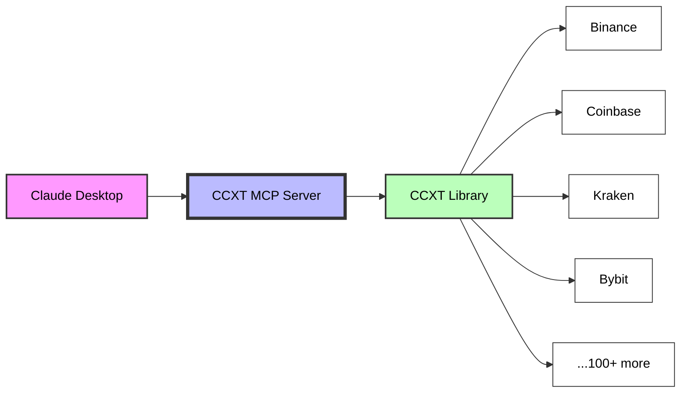
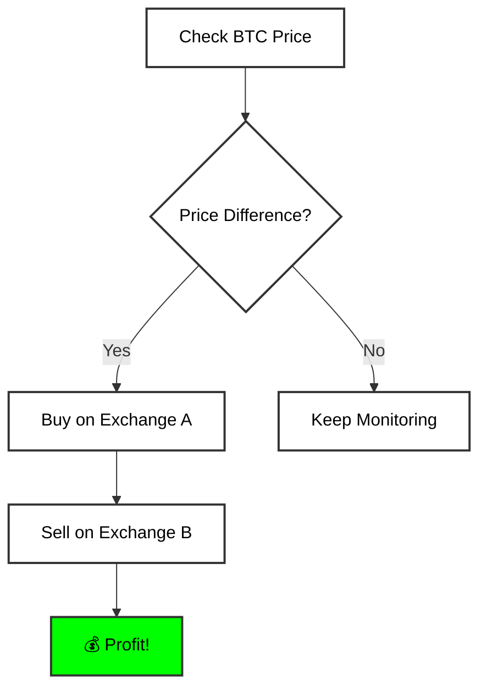
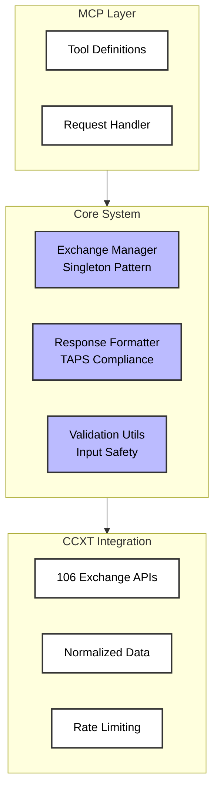

# 🚀 CCXT MCP Server

[](./docs/standards/TAPS-v1.0-STANDARD.md)
[](https://github.com/ccxt/ccxt)
[](./LICENSE)

**Universal cryptocurrency exchange access for Claude** - Trade on 100+ exchanges through a single MCP interface!

## 🌟 What This Does



This MCP server gives Claude the ability to:
- 📈 **Get real-time prices** from any crypto exchange
- 📊 **Analyze order books** and market depth
- 🔄 **Compare prices** across exchanges instantly
- 💰 **Detect arbitrage opportunities** automatically
- 📉 **Fetch historical data** for technical analysis
- 📐 **Calculate technical indicators** (RSI, MACD, Bollinger Bands, ATR, Stochastic, Ichimoku)

## ⚡ Quick Start (2 minutes)

### 1️⃣ Install
```bash
# Clone the repository
git clone https://github.com/MyronKoch/ccxt-mcp-server.git
cd ccxt-mcp-server

# Install dependencies
npm install

# Build the project
npm run build
```

### 2️⃣ Add to Claude Desktop
```json
{
  "mcpServers": {
    "ccxt-mcp-server": {
      "command": "node",
      "args": ["/path/to/ccxt-mcp-server/dist/index.js"]
    }
  }
}
```

### 3️⃣ Restart Claude & Trade!
Ask Claude: *"What's the price of Bitcoin on Binance?"*

## 🛠️ Available Tools

### 📋 Exchange Management
| Tool | Description | Example |
|------|-------------|---------|
| `exchange_list` | List all 106 supported exchanges | "Show me all available exchanges" |
| `exchange_init` | Connect to specific exchange | "Initialize Binance connection" |
| `exchange_status` | Check if exchange is working | "Is Coinbase operational?" |
| `exchange_markets` | Get trading pairs | "What pairs does Kraken support?" |

### 📊 Market Data (No Auth Required!)
| Tool | Description | Example |
|------|-------------|---------|
| `market_ticker` | Current prices | "BTC price on Binance" |
| `market_orderbook` | Bids & asks | "Show ETH order book" |
| `market_trades` | Recent trades | "Latest SOL trades" |
| `market_ohlcv` | Candlestick data | "1-hour BTC chart data" |

### 💼 Account & Analytics
| Tool | Description | Example |
|------|-------------|---------|
| `account_balance` | Check balances (requires env API keys) | "My Binance balance" |
| `analytics_compare_prices` | Multi-exchange comparison | "Compare ETH on all exchanges" |

### 📐 Technical Analysis
| Tool | Description | Example |
|------|-------------|---------|
| `indicators_calculate` | Calculate technical indicators | "Calculate RSI and MACD for BTC/USDT on Binance" |

**Supported Indicators:**
- **RSI** - Relative Strength Index (overbought/oversold detection)
- **MACD** - Moving Average Convergence Divergence (trend detection)
- **Bollinger Bands** - Volatility and price range analysis
- **ATR** - Average True Range (volatility measurement)
- **Stochastic** - Momentum oscillator
- **Ichimoku Cloud** - Comprehensive trend analysis

## 🎯 Killer Features

### 🔍 Arbitrage Detection


The server automatically detects when the same asset has different prices across exchanges!

### ⚡ Real Examples

```
You: "Compare Bitcoin prices across major exchanges"

Claude: Analyzing BTC/USDT across exchanges...

📊 Price Comparison:
• Binance:   $67,234.50 
• Coinbase:  $67,256.00 (+$21.50)
• Kraken:    $67,245.75 (+$11.25)
• Bybit:     $67,232.00 (-$2.50)

🎯 Arbitrage Opportunity Detected!
Buy on Bybit at $67,232.00
Sell on Coinbase at $67,256.00
Potential profit: $24.00 per BTC (0.036%)
```

```
You: "Calculate RSI and MACD for BTC/USDT on Binance"

Claude: Analyzing Bitcoin technical indicators...

📐 Technical Analysis (1-hour timeframe):

RSI (14): 58.32
• Signal: Neutral
• Not overbought (>70) or oversold (<30)

MACD:
• MACD Line: 234.50
• Signal Line: 198.25
• Histogram: 36.25 (Bullish)
• Trend: Bullish momentum increasing

Bollinger Bands:
• Upper: $67,850
• Middle: $67,234
• Lower: $66,618
• Current price within normal range

💡 Interpretation: Moderate bullish momentum with RSI in neutral zone.
MACD showing positive divergence. Consider entry on pullback to middle band.
```

## 🏗️ Architecture

### System Design


### TAPS v1.0 Response Format
```json
{
  "success": true,
  "data": {
    "symbol": "BTC/USDT",
    "bid": 67234.50,
    "ask": 67235.00,
    "last": 67234.75
  },
  "metadata": {
    "exchange": "binance",
    "timestamp": 1738123456789,
    "rateLimit": { "remaining": 99, "reset": 1738123460 },
    "version": "TAPS-1.0.0"
  }
}
```

## 🔒 Security

- 🔐 **Environment-only credentials** - API keys MUST be set via environment variables (never in request parameters)
- ⏱️ **Adaptive rate limiting** - Automatic exponential backoff prevents exchange bans
- 🔄 **Automatic retries** - Smart retry logic (up to 5 attempts) with backoff
- 🛡️ **Input validation** - Prevents costly mistakes and malformed requests
- 🧹 **Credential sanitization** - No leaks in logs or responses
- ✅ **Testnet support** - Safe development environment

### Setting Up API Credentials

For account operations, set credentials as environment variables:

```bash
# .env file
BINANCE_API_KEY=your_api_key_here
BINANCE_SECRET=your_secret_here

# For other exchanges, use: EXCHANGEID_API_KEY and EXCHANGEID_SECRET
COINBASE_API_KEY=...
COINBASE_SECRET=...
```

**Security Note:** Credentials are NEVER accepted as tool parameters to prevent leakage in MCP logs.

## 📈 Supported Exchanges (106 Total!)

<details>
<summary><b>🌟 Tier 1 - Fully Tested</b></summary>

- Binance (+ Testnet)
- Coinbase (+ Sandbox) 
- Kraken
- Bybit (+ Testnet)
- OKX

</details>

<details>
<summary><b>🚀 Tier 2 - Major Exchanges</b></summary>

- Bitfinex
- Huobi
- Gate.io
- KuCoin
- Bitget
- Bitstamp
- Gemini
- Crypto.com
- MEXC
- And 90+ more...

</details>

## 🧑‍💻 Development

```bash
# Install dependencies
npm install

# Development mode with hot reload
npm run dev

# Build for production
npm run build

# Run tests
npm test
```

### Project Structure
```
ccxt-mcp-server/
├── src/
│   ├── index.ts                    # Main MCP server
│   ├── exchange-manager.ts         # Exchange instance management with rate limiting
│   ├── response-formatter.ts       # TAPS response formatting
│   ├── arbitrage/
│   │   └── advanced-scanner.ts     # Real-time arbitrage detection
│   ├── cache/
│   │   └── lru-cache-manager.ts    # LRU caching for market data
│   ├── indicators/
│   │   └── technical-analysis.ts   # RSI, MACD, Bollinger, ATR, Stochastic, Ichimoku
│   ├── rate-limiting/
│   │   └── adaptive-limiter.ts     # Exponential backoff retry logic
│   ├── risk/
│   │   └── risk-manager.ts         # Kelly Criterion, position sizing
│   ├── utils/
│   │   └── validation.ts           # Input validation and sanitization
│   └── types/
│       └── taps.ts                 # TAPS v1.0 type definitions
├── dist/                           # Compiled JavaScript
├── tests/                          # Comprehensive test suite
└── docs/
    ├── standards/
    │   └── TAPS-v1.0-STANDARD.md  # Protocol specification
    ├── architecture/
    │   └── ARCHITECTURE.md         # System design
    └── guides/
        └── TESTING-GUIDE.md        # Testing documentation
```

## 🐛 Troubleshooting

| Issue | Solution |
|-------|----------|
| "Exchange not found" | Check exact exchange ID (lowercase, e.g., `binance` not `Binance`) |
| "Rate limit exceeded" | Server auto-retries with exponential backoff (up to 5 attempts) |
| "Invalid symbol" | Use format: `BTC/USDT` not `BTCUSDT` |
| "No balance data" | Set `EXCHANGEID_API_KEY` and `EXCHANGEID_SECRET` environment variables |
| "Invalid credentials" | Credentials must be in `.env` file, NOT in tool parameters |
| Build errors | Run `npm install` to ensure all dependencies are installed |
| Type errors | Run `npm run build` - TypeScript is configured with Node.js types |

## 📊 Performance

- ⚡ **Response time**: < 2 seconds (< 1ms for cache hits)
- 🔄 **Concurrent requests**: Unlimited with automatic rate limiting
- 💾 **Memory usage**: < 100MB
- 🌐 **Exchange connections**: Cached & reused
- 📦 **Smart caching**: 100% coverage on market data endpoints
  - Tickers: 10s TTL
  - Order books: 5s TTL
  - Trades: 10s TTL
  - OHLCV: 60s TTL
  - Markets: 1hr TTL
- 🔁 **Auto-retry**: Exponential backoff on errors (1s → 2s → 4s → 8s → 16s)

## 🤝 Contributing

This is a **TAPS v1.0** reference implementation. PRs welcome!

1. Fork the repository
2. Create your feature branch
3. Follow TAPS v1.0 standards
4. Submit a pull request

## 📜 License

MIT - Use freely in commercial projects!

## 🙏 Credits

- **CCXT** - The amazing library that makes this possible
- **MCP** - Anthropic's Model Context Protocol
- **TAPS v1.0** - Trading API Protocol Standard (created for this project)

---

<div align="center">
<b>Built with ❤️ by Myron Koch</b><br/>
<i>First universal crypto exchange MCP server ever created!</i><br/><br/>
<a href="https://github.com/ccxt/ccxt">CCXT</a> •
<a href="./docs/standards/TAPS-v1.0-STANDARD.md">TAPS v1.0</a> •
<a href="https://modelcontextprotocol.com">MCP</a>
</div>

## 📚 Documentation

- **[TAPS v1.0 Standard](./docs/standards/TAPS-v1.0-STANDARD.md)** - Trading API Protocol Standard specification
- **[Architecture Guide](./docs/architecture/ARCHITECTURE.md)** - System design and patterns
- **[Testing Guide](./docs/guides/TESTING-GUIDE.md)** - Comprehensive testing documentation
- **[Implementation Roadmap](./docs/roadmaps/IMPLEMENTATION-ROADMAP.md)** - Development phases
- **[Ultimate Roadmap](./docs/roadmaps/ULTIMATE-IMPLEMENTATION-ROADMAP.md)** - Future vision & competitive analysis
